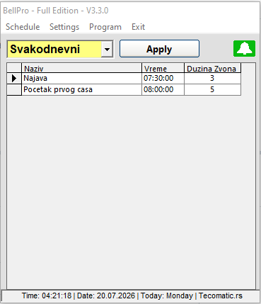
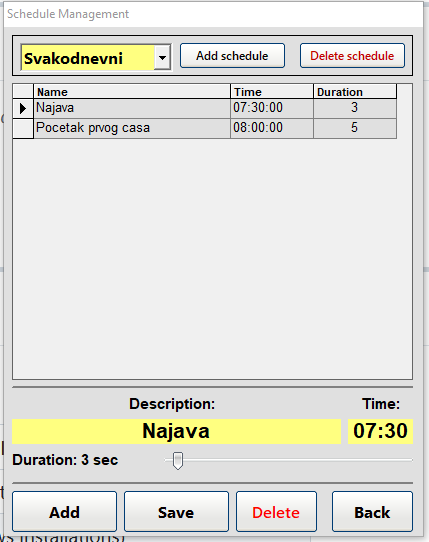
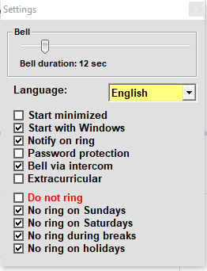

# BellPro: School Bell Automation System

[](LICENSE)
[]()
[]()
[]()
[](https://github.com/milosavljevic92/bellpro-project/releases)
[](https://github.com/milosavljevic92/bellpro-project/stargazers)
[](https://github.com/milosavljevic92/bellpro-project/network/members)
[](https://github.com/milosavljevic92/bellpro-project/commits/main)

BellPro is a robust, open-source software solution designed to automate school bell ringing. By interfacing a PC with an existing school PA system via a custom RS232 hardware interface, BellPro eliminates manual operation and ensures high-precision timing for classes, breaks, and extracurricular activities.

> Originally conceptualized in 2007 and refined over nearly two decades, BellPro has been deployed in numerous schools across Serbia. This repository provides the complete ecosystem needed to deploy the system: VB6 source code, PCB designs for the relay interface, and installation scripts.

---

## Table of Contents

- [Key Features](#key-features)
- [Screenshots](#screenshots)
- [Installation Guide](#installation-guide)
- [User Guide](#user-guide)
- [Technical Architecture](#technical-architecture)
- [Hardware Setup](#hardware-setup)
- [Multi-Language Support](#multi-language-support)
- [Developer Guide](#developer-guide)
- [Configuration Reference](#configuration-reference)
- [Troubleshooting](#troubleshooting)
- [FAQ](#faq)
- [Roadmap](#roadmap)
- [Contributing](#contributing)
- [License](#license)

---

## Key Features

- **Unlimited Named Schedules** - Create and manage any number of named bell schedules (e.g. *Regular*, *Short Classes*, *Exam Day*). Switch the active schedule with a single click.
- **Smart Calendar Logic** - The engine automatically suppresses ringing on weekends, up to 12 defined public holidays, and up to 4 seasonal school break periods.
- **Extracurricular Support** - A separate day-of-week schedule for sports events, evening activities, or other recurring non-teaching events.
- **Bell Output Modes** - Drive a physical relay (via RS232 RTS pin), play an MP3 file through the PC speakers/PA system, or both simultaneously.
- **System Resilience** - Configurable auto-start with Windows and automatic recovery after power outages or reboots.
- **PIN Protection** - Secure the entire configuration behind a 4-digit PIN to prevent unauthorized changes.
- **Data Portability** - Import and export any schedule as an XML file for backup, sharing, or bulk deployment across multiple schools.
- **Desktop Notifications** - Optional animated tray popup shows the bell time and description when the bell fires.
- **Manual Override** - Ring or stop the bell at any time from the manual control panel, independently of the schedule.
- **Multi-Language UI** - Interface available in 13 languages, switchable live at runtime without any restart.

---

## Screenshots

> *(Add screenshots to a `Docs/screenshots/` folder and update these paths.)*

| Main Window | Schedule Editor | Settings |
|---|---|---|
|  |  |  |

---

## Installation Guide

### Prerequisites

| Component | Details |
|-----------|---------|
| OS | Windows XP / Vista / 7 / 10 / 11 (32-bit or 64-bit with WOW64) |
| Runtime | VB6 runtime (included in most Windows installations) |
| SQLite ODBC | `sqliteodbc.exe` - provided in `Tools\` folder |
| Serial port | Native COM port recommended; USB-to-Serial supported (see [Hardware](#hardware-setup)) |

### Step-by-Step

1. **Install the SQLite ODBC Driver**
   Run `Tools\sqliteodbc.exe` before launching BellPro for the first time. Without this driver the application cannot open its database and will exit immediately.

2. **Register OCX components** *(only if you see "Component not found" errors)*
   Open a Command Prompt as Administrator and run:
   ```
   regsvr32 "C:\path\to\BellPro\InstallScript\dll\msdatgrd.ocx"
   ```
   This registers the MSDataGrid control used by the schedule editor.

3. **Launch BellPro**
   Run `BellPro.exe`. On first launch the registration screen appears. You can:
   - Enter a valid license key (generated by the included KeyGenerator for your PC's volume serial number), or
   - Click **DEMO** to run in demo mode (interface hardware disabled, full scheduling functionality available).

4. **Configure the serial interface**
   Go to **Program → Interface**, select the correct COM port and interface type, and click **TEST** to verify the relay fires correctly.

5. **Set up your first schedule**
   Go to **Schedule → Edit**, select or create a schedule, and add bell times. Click **Apply** on the main screen to activate it.

---

## User Guide

### Main Window

The main window shows the active schedule in a grid, the current time and date in the status bar, and interface connection status icons in the top-right corner.

- **Green bell icon** - bell is active today (schedule will fire)
- **Red bell icon** - bell is suppressed today (weekend, holiday, or break)
- **Interface icons** - show whether the RS232 relay interface is connected and detected

Use the **Schedule** dropdown and **Apply** button to switch the active schedule without opening the editor.

### Schedules

BellPro uses named schedules. Each schedule contains any number of timed bell entries, each with:
- **Time** - in `HH:MM` format (24-hour)
- **Description** - shown in the notification popup when the bell fires
- **Duration** - how long the relay/sound stays active (in seconds)

The built-in `Svakodnevni` (*Everyday*) schedule is the system default and cannot be deleted. All other schedules can be freely created, renamed, and removed.

**To create a new schedule:** Schedule → Edit → Add Schedule → enter a name → Create.

**To import/export:** Schedule → Import / Export. The file format is XML, compatible between BellPro installations.

### Public Holidays

Up to **12 specific dates** can be defined as public holidays (Program → Holidays). On those dates the bell will not ring if the *Do not ring on holidays* option is enabled in Settings.

### School Breaks

Up to **4 date ranges** can be defined as school breaks (Program → Breaks). Bell suppression during breaks is toggled separately in Settings.

### Extracurricular Activities

A separate weekly schedule (Program → Extracurricular) allows different bell times on specific days of the week. This schedule runs in parallel with the main schedule when *Extracurricular activities* is enabled in Settings.

### Manual Bell Control

Program → Manual Bell opens a panel that lets you ring or stop the bell immediately, independently of the schedule timer. Choose the output mode (Relay, Intercom, or both) from the dropdown.

### Settings

| Setting | Description |
|---------|-------------|
| Bell duration | Default relay/sound activation time in seconds |
| Bell via intercom | Play MP3 audio through the PC sound output |
| Extracurricular activities | Enable the parallel extracurricular schedule |
| Password protection | Require PIN to access settings and schedule editor |
| Start with Windows | Add BellPro to the Windows startup registry key |
| Notify when bell rings | Show desktop popup when the bell fires |
| Minimize on startup | Start minimized to the system tray |
| Do not ring | Master mute - suppress all ringing regardless of schedule |
| Do not ring on holidays | Suppress ringing on dates defined in the Holidays list |
| Do not ring on Saturdays | Suppress ringing every Saturday |
| Do not ring on Sundays | Suppress ringing every Sunday |
| Do not ring during breaks | Suppress ringing during date ranges defined in Breaks |
| Language | UI language - takes effect immediately, no restart needed |

### PIN Protection

When password protection is enabled, the main interface is locked on startup. Click **Lock/Unlock** in the Program menu to toggle. The default PIN is `1111`. Change it via Program → Security.

---

## Technical Architecture

### Overview

```
┌─────────────────────────────────────────────────────────┐
│                     BellPro.exe                          │
│                                                          │
│  FrmMain ──── TrmProvera (1 sec timer)                  │
│       │            │                                     │
│       │      ProveriSve() ──── MdlBellLogic             │
│       │            │          (weekend/holiday/break     │
│       │            │           suppression logic)        │
│       │      SQLite query ─── base.sqlite               │
│       │      (match current time vs schedule)            │
│       │            │                                     │
│       │      UpaliZvono() ──┬── CntrlSerial.HitTheRelay │
│       │                     │   (RS232 RTS pin)          │
│       │                     └── MdlSound.PlayMp3Sound   │
│       │                         (audio output)           │
│  MdlLanguage ─── language\*.lng                         │
│  (T(), ApplyLanguage, InitLanguage)                      │
└─────────────────────────────────────────────────────────┘
```

### Module Reference

| Module | Purpose |
|--------|---------|
| `MdlStart.bas` | Application entry point (`Sub Main`). Checks for duplicate instances, initializes config, loads language, shows registration screen. |
| `MdlBellLogic.bas` | `ProveriSve()` - evaluates whether the bell should be suppressed right now based on day-of-week, holiday list, and break date ranges. Returns `True` if suppressed. |
| `MdlCommunication.bas` | High-level wrappers for `OpenPort`, `ClosePort`, `HitTheRelay`, `CheckInterface`, `PortState`. Delegates to `CntrlSerial`. |
| `MdlBellProRelay.bas` | HID USB relay driver (alternative interface using `VID_16D0&PID_0753` HID device via `CreateFile`/`WriteFile` kernel32 calls). |
| `MdlExternalDevices.bas` | Placeholder for future external device integrations. |
| `MdlLanguage.bas` | Full localization engine - INI parser, in-memory key-value cache, `T()` translation function, `ApplyLanguage()` for runtime form refresh. |
| `MdlLocalization.bas` | Legacy stub kept for backward compatibility. Delegates to `MdlLanguage`. |
| `MdlHelper.bas` | Utility functions: `VolumeSerialNumber`, `checkDoesDBexist`, `ProveriFormatVremena`, `getConfigPath`, `Kriptuj` (XOR cipher for PIN storage), `GenerateIniFileIfNotExist`. |
| `MdlLicenca.bas` | License key generation and validation (ADFGVX cipher). |
| `MdlSound.bas` | MP3 playback via Windows MCI (`initPlayer`, `PlayMp3Sound`, `StopMp3Sound`). |
| `MdlSysTray.bas` | System tray icon management via `Shell_NotifyIcon` Win32 API. |
| `MdlStartUp.bas` | Windows Registry helpers: `SetRegValue`, `DeleteValue` for auto-start key management. |
| `MdlUseIni.bas` | INI file read/write via `GetPrivateProfileString` / `WritePrivateProfileString` Win32 API. |
| `MdlOpenCloseDialog.bas` | Common file open/save dialog (`GetOpenFileName` / `GetSaveFileName` Win32 API). |

### Form Reference

| Form | Purpose |
|------|---------|
| `FrmMain` | Main window. Contains the schedule grid, status bar, tray icon, 1-second bell timer (`TrmProvera`), and all menu navigation. |
| `FrmSplash` | Splash and About screen. Displays version, registered user, and installation date. |
| `FrmRegistracija` | License registration. Reads the volume serial number as hardware fingerprint, validates the entered license key, or enables demo mode. |
| `FrmPodesavanje` | All application settings including bell duration, output mode, calendar suppression flags, language selection, and PIN protection toggle. |
| `FrmSvakodnevni` | Main schedule editor. Manages multiple named schedules and their time entries via a DataGrid. |
| `FrmVanNastavne` | Extracurricular schedule editor. Day-of-week time entries with separate bell descriptions and durations. |
| `FrmNoviRaspored` | Simple single-input dialog for naming a new schedule. |
| `FrmExport` | Export any schedule to XML file via the common save dialog. |
| `FrmRaspusti` | Define up to 4 school break date ranges (from/to date pairs). |
| `FmrPraznik` | Define up to 12 specific public holiday dates. |
| `FrmRucnoZ` | Manual bell panel. Ring or stop the bell instantly with output mode selector (Relay / Intercom / Both). |
| `FrmInterfejs` | Serial interface configuration. Select COM port, interface type (BellCommDirect / BellProRelay / None), DTR/CTS detection toggle, and RTS inversion. Includes a live TEST button. |
| `FrmOtkljucavanje` | PIN entry dialog for unlocking the application. |
| `FrmZastita` | Change the 4-digit PIN. Requires confirmation of current PIN before allowing change. |
| `FrmZvoni` | Animated notification popup shown when the bell fires. Slides in from the bottom-right corner and auto-dismisses after the bell duration. |

### Custom Controls

| Control | Purpose |
|---------|---------|
| `CntrlSerial.ctl` | RS232 serial port wrapper around the `MSComm` OCX. Provides `OpenPort`, `ClosePort`, `HitTheRelay`, `CheckInterface`, `PortState`. |
| `Command Button.ctl` | Custom XP-style button with hover color effects (`XPButton`). |
| `Sld.ctl` | Custom horizontal slider control used for bell duration selection. |
| `Duncan_DatePicker.ctl` | Date picker control used in the Breaks and Holidays forms. |

### Database Schema

BellPro uses a single SQLite database (`base.sqlite`). The two main tables are:

**`Raspored`** - Bell time entries

| Column | Type | Description |
|--------|------|-------------|
| ID | INTEGER | Primary key |
| Raspored | TEXT | Schedule name this entry belongs to |
| Naziv | TEXT | Bell description (shown in notification) |
| Vreme | TEXT | Time in `HH:MM:SS` format |
| Dan | TEXT | Day filter (`pon - ned` for daily, or specific day for extracurricular) |
| DuzinaZvona | TEXT | Duration string e.g. `12 sec` |

**`NaziviRasporeda`** - Schedule name registry

| Column | Type | Description |
|--------|------|-------------|
| ID | INTEGER | Primary key |
| Naziv | TEXT | Schedule name |

### Bell Firing Logic

Every second, `TrmProvera` fires and executes this sequence:

```
1. Call ProveriSve()
   ├── Is "Do not ring" enabled?           → suppress
   ├── Is today Saturday + setting on?     → suppress
   ├── Is today Sunday + setting on?       → suppress
   ├── Is today a defined holiday?         → suppress
   └── Is today within a break range?     → suppress

2. If NOT suppressed:
   Query: SELECT * FROM Raspored
          WHERE Raspored = <active_schedule>
          AND Vreme = <current HH:MM:SS>

3. If match found:
   ├── Disable timer (prevent re-trigger)
   ├── Show notification popup (if enabled)
   ├── HitTheRelay(True)   → RS232 RTS high
   ├── PlayMp3Sound        → audio (if enabled)
   └── Start TrmZvoni with interval = duration × 1000 ms

4. TrmZvoni fires after duration:
   ├── HitTheRelay(False)  → RS232 RTS low
   ├── StopMp3Sound
   └── Re-enable TrmProvera
```

---

## Hardware Setup

### RS232 Relay Interface

The relay interface converts the RS232 RTS signal (±12V) to a clean relay contact suitable for triggering a school PA system amplifier or bell solenoid.

**Recommended circuit features:**
- Optocoupler isolation between the PC and the relay circuit
- 5V relay driven by a transistor stage
- LED indicator on the relay output
- Screw terminal block for PA system connection

PCB design files (Sprint Layout 5.0 format) are located in `Hardware\`.

**Serial port pinout used:**

| RS232 Pin | Signal | Direction | Function |
|-----------|--------|-----------|----------|
| Pin 7 | RTS | PC → Interface | Relay drive output |
| Pin 4 | DTR | PC → Interface | Interface detection loopback source |
| Pin 8 | CTS | Interface → PC | Interface detection loopback return |
| Pin 5 | GND | - | Signal ground |

The DTR→CTS loopback allows BellPro to detect whether the interface board is physically connected. If CTS does not follow DTR, the status icon shows "interface not found" even if the port is open.

### Recommended Hardware

- **Native serial port** on the motherboard is strongly preferred. PCI/PCIe serial cards also work reliably.
- **USB-to-Serial adapters:** Use only adapters based on the **FTDI FT232RNL** chipset. Prolific PL-2303 and CH340-based adapters can cause timing instability.
  - Tested adapter: [Digitus DA-70156](https://de.assmann.shop/en/Cables-and-Peripherals/Computer-Accessories/IO-Cards/USB-2-0-serial-adapter.html)

> **Note:** Some motherboards toggle RS232 lines during BIOS POST on startup or restart. This may cause a brief unintended relay click before Windows loads. If this is a concern, add a power-on delay relay to the hardware circuit.

---

## Multi-Language Support

The UI language can be changed live at runtime from **Settings → Language**. The change applies immediately to the current form and to all other open forms. The selection is saved in `config.ini` and restored on next launch.

### Supported Languages

| Language | File | Encoding |
|----------|------|----------|
| 🇷🇸 Serbian *(default)* | `Serbian_language.lng` | Windows-1250 |
| 🇧🇦 Bosnian | `Bosnian_language.lng` | Windows-1250 |
| 🇭🇷 Croatian | `Croatian_language.lng` | Windows-1250 |
| 🇸🇮 Slovenian | `Slovenian_language.lng` | Windows-1250 |
| 🇲🇰 Macedonian | `Macedonian_language.lng` | Windows-1250 (Latin transliteration) |
| 🇬🇧 English | `English_language.lng` | Windows-1250 |
| 🇩🇪 German | `German_language.lng` | Windows-1250 |
| 🇫🇷 French | `French_language.lng` | Windows-1250 |
| 🇮🇹 Italian | `Italian_language.lng` | Windows-1250 |
| 🇪🇸 Spanish | `Spanish_language.lng` | Windows-1250 |
| 🇩🇰 Danish | `Danish_language.lng` | Windows-1250 |
| 🇭🇺 Hungarian | `Hungarian_language.lng` | Windows-1250 |
| 🇬🇷 Greek | `Greek_language.lng` | Windows-1250 (Latin transliteration) |

### Language File Format

Language files are plain INI-style text files. Sections correspond to form names; keys correspond to VB6 control names or message identifiers:

```ini
; BellPro - English Language File
; Tecomatic | office@tecomatic.rs

[FrmPodesavanje]
Caption=Settings
Frame2=Bell
lblDuzinaZvona=Bell duration:
chNeZvoni=Do not ring
chNeZvoniSubotom=No ring on Saturdays
MsgJezikPromenjen=Language changed. Reopen forms to refresh.
SufixSec= sec

[FrmRucnoZ]
Caption=Manual Bell
cmdRucnoZvoni=Ring Bell
CmdUpali=Ring Bell
CmdUgasi=Stop Bell
```

**Rules:**
- Keys before `=` are **VB6 control names** (exact match, case-insensitive) for labels, checkboxes, buttons, and menu items.
- Keys starting with `Msg` are **message strings** used in `MsgBox` and notification calls via `T("Section", "Key")`.
- Keys ending with `_Tip` are **tooltip strings** for image and combo controls.
- `SufixSec` is appended to numeric duration labels.
- The `Caption` key sets the form title bar.

### Adding a New Language

1. Copy `language\English_language.lng` → `language\MyLanguage_language.lng`
2. Translate all values (right side of `=`). Never modify keys (left side).
3. Save as **Windows-1250 encoding** with **CRLF line endings**.
4. Launch BellPro - the language appears automatically in the dropdown.

> For scripts that cannot be encoded in Windows-1250 (Arabic, Hebrew, Chinese, Japanese, Korean, Thai...) use Latin transliteration. The VB6 runtime reads files as raw bytes and does not perform Unicode conversion.

### Localization API (`MdlLanguage.bas`)

Developers adding new forms or messages should use these public functions:

```vb
' Load a language file into memory (called once at startup)
Call InitLanguage(GetSavedLang())

' Apply all translations to a form's controls (call from Form_Load)
ApplyLanguage Me

' Translate a single key in code (MsgBox, dynamic labels, etc.)
MsgBox T("FrmMain", "MsgRasporedPrimenjen"), vbInformation
lblLen.Caption = T("FrmSvakodnevni", "LblDuzinaZvona") & " " & value & T("FrmSvakodnevni", "SufixSec")

' Re-apply language to ALL currently open forms (called after language change)
RefreshAllForms

' Get/set the saved language code from config.ini
lang = GetSavedLang()
SaveLang "English"

' Get localized day name by weekday index (1=Monday, 7=Sunday)
dayStr = GetDayName(Weekday(Date) - 1)
```

---

## Developer Guide

### Building from Source

**Requirements:**
- Microsoft Visual Basic 6.0 (SP6 recommended)
- SQLite ODBC Driver installed
- All referenced OCX/DLL files registered (see Installation Guide)

**Steps:**
1. Open `BellPro.vbp` in the VB6 IDE.
2. Verify all references resolve in **Project → References** and **Project → Components**.
3. Press **F5** to run in debug mode, or **File → Make BellPro.exe** to compile.

**Debug mode:** Set `setDebugMode True` in `MdlStart.bas` to disable all `On Error Resume Next` guards, making runtime errors visible. A hidden TEST TIME button also appears in the schedule editor to populate test data.

### Adding a New Form

1. Create the form in the VB6 IDE.
2. Add `ApplyLanguage Me` as the **first line** of `Form_Load`.
3. Add a section `[FrmMyForm]` to all `.lng` files in `language\`.
4. For each translatable control, add `ControlName=Translation` under that section.
5. For `MsgBox` calls, use `MsgBox T("FrmMyForm", "MsgMyKey"), vbInformation` and add `MsgMyKey=Text` to the `.lng` files.

### Adding a New Language String

1. Add the key-value pair to **all** language files in `language\` under the appropriate `[Section]`.
2. In code, reference it with `T("SectionName", "KeyName")`.
3. `T()` returns the key name itself as a fallback if the key is missing - so missing translations are visible during testing.

### config.ini Key Reference

All runtime settings are stored in `config.ini` in the application directory.

| Key | Default | Description |
|-----|---------|-------------|
| `021` | `Svakodnevni` | Active schedule name |
| `023` | `COM1` | Serial port (e.g. `COM3`) |
| `024` | `BellCommDirect` | Interface type: `BellCommDirect`, `BellProRelay`, or `Bez interfejsa` |
| `025` | `12` | Bell duration in seconds |
| `026` | `1` | Start with Windows (1=yes, 0=no) |
| `027` | `1` | Notify on bell ring (1=yes, 0=no) |
| `028` | `0` | Master mute - do not ring (1=yes, 0=no) |
| `029` | `1` | Start minimized (1=yes, 0=no) |
| `030` | `1` | Do not ring on Saturdays (1=yes, 0=no) |
| `031` | `1` | Do not ring on Sundays (1=yes, 0=no) |
| `032` | `0` | Do not ring during breaks (1=yes, 0=no) |
| `034` | `1` | Do not ring on holidays (1=yes, 0=no) |
| `035` | `0` | PIN protection enabled (1=yes, 0=no) |
| `036` | `1` | Extracurricular activities enabled (1=yes, 0=no) |
| `037` | `1` | Bell via intercom/MP3 (1=yes, 0=no) |
| `040` | `1` | DTR/CTS interface detection enabled (1=yes, 0=no) |
| `041` | `0` | Invert RTS relay output (1=yes, 0=no) |
| `050` | `Serbian` | UI language (matches `<name>_language.lng`) |
| `013`–`020` | - | Break date ranges (pairs: start/end for 4 breaks) |
| `001`–`012` | - | Public holiday dates (up to 12, in `dd.MM.yyyy` format) |

---

## Troubleshooting

### Bell does not ring at all

| Check | Solution |
|-------|----------|
| *Do not ring* is enabled in Settings | Uncheck the master mute option |
| Today is a weekend / holiday / break | Check calendar suppression settings |
| No active schedule selected | Open main window, select schedule, click **Apply** |
| Time in schedule is wrong format | Must be `HH:MM` - confirm with schedule editor |
| Database not found | Reinstall SQLite ODBC driver, verify `base.sqlite` is present |

### "Component not found" on startup

Register the missing OCX file as Administrator:
```
regsvr32 "C:\BellPro\InstallScript\dll\msdatgrd.ocx"
```
If the error persists, check **Project → Components** in the VB6 IDE for all missing entries.

### Interface shows "port open but not found"

- Verify the physical relay board is connected to the correct COM port.
- Check that the DTR→CTS loopback wire is present on the interface board.
- Try disabling *Interface Detection* in Program → Interface if you do not use the loopback.

### Bell rings briefly on system startup/reboot

This is caused by the motherboard toggling RS232 signals during BIOS POST before Windows loads. Add a power-on delay relay (e.g. 10–30 second delay) to the relay board circuit to mask the startup transient.

### USB-to-Serial adapter causes missed or double rings

Switch to a native COM port or replace the adapter with an **FTDI FT232RNL**-based model. Prolific PL-2303 and CH340 adapters are known to cause timing issues with the 1-second poll interval.

### Language file not appearing in dropdown

- Confirm the file is named exactly `LanguageName_language.lng` (underscore before *language*).
- Confirm it is saved in **Windows-1250 encoding** with **CRLF line endings** - not UTF-8, not LF-only.
- Confirm the file is in the `language\` subfolder next to `BellPro.exe`.

### Language displays garbled characters

Delete old language files from the `language\` folder and replace with the current versions from the repository. Old files may be UTF-8 encoded; BellPro requires Windows-1250.

---

## FAQ

**Q: Can BellPro run on a 64-bit version of Windows 10 or 11?**  
Yes. BellPro is a 32-bit VB6 application and runs under WOW64 on all 64-bit Windows versions. The 32-bit SQLite ODBC driver must be used (not the 64-bit version).

**Q: Can I run multiple schedules for different parts of the school simultaneously?**  
Not in a single instance. BellPro activates one schedule at a time. For parallel schedules (e.g. different wings of a building on different timetables) run separate instances of BellPro with separate databases and separate COM ports.

**Q: What happens if the PC restarts during the school day?**  
With *Start with Windows* enabled, BellPro launches automatically after Windows loads. Any bells that occurred while the PC was down are not replayed - the system resumes normal operation from the next scheduled entry.

**Q: Can I use BellPro without the RS232 relay hardware?**  
Yes. Set the interface type to *No interface* in Program → Interface. BellPro will still fire the schedule on time and can play MP3 audio through the PC's sound card. This is useful for testing or for PA systems with a line-in trigger.

**Q: Where is the license key tied to?**  
The license key is generated from the **volume serial number** of the system drive (C:). If you replace the hard drive or reformat, you will need a new license key. Use the included KeyGenerator utility.

**Q: How do I back up my schedules?**  
Use Schedule → Export to save each schedule as an XML file. Alternatively, copy `base.sqlite` directly - it contains all schedules and bell entries.

**Q: Can I add more than 12 public holidays?**  
Not in the current version. The holiday system supports up to 12 specific dates. For recurring annual holidays, re-enter them each school year. The Roadmap includes plans for recurring holiday rules.

**Q: How do I add a new language?**  
Copy any existing `.lng` file from the `language\` folder, rename it `LanguageName_language.lng`, translate the values, save as Windows-1250 with CRLF line endings, and restart BellPro. See [Adding a New Language](#adding-a-new-language).

---

## Roadmap

- **Standalone embedded version** - Port scheduling logic to an ESP32 or AVR microcontroller for operation without a PC. *(See [BellPro Embedded](https://github.com/tecomatic/bellpro-embedded))*
- **Additional languages** - Contribute new `.lng` translation files.
- **Installer** - NSIS or Inno Setup installer to automate ODBC driver installation and OCX registration.
- **Ring event log** - Timestamped log file of all bell events for audit and troubleshooting.
- **Network time sync** - NTP-based time correction to compensate for PC clock drift.
- **Schedule templates** - Predefined schedule templates for common Serbian school timetable formats.

---

## Contributing

If you deploy BellPro in a school or organization, please open an issue to document it - it helps track the project's reach and impact.

Contributions of all kinds are welcome: code improvements, new language files, hardware design variants, bug reports, or documentation updates.

```bash
# 1. Fork the repository on GitHub
# 2. Clone your fork
git clone https://github.com/your-username/bellpro.git

# 3. Create a feature branch
git checkout -b feature/my-improvement

# 4. Make your changes and commit
git commit -m "Add: description of change"

# 5. Push and open a Pull Request
git push origin feature/my-improvement
```

**For new language files:** simply add `language\LanguageName_language.lng` and open a PR. No code changes needed.

---

## License

BellPro is released under the [MIT License](LICENSE) - free to use, modify, and redistribute, provided the original copyright notice is retained in all copies or substantial portions of the software.

---

*Developed and maintained by [Tecomatic](https://tecomatic.rs) - Novi Sad, Serbia.*  
*Inspired by the school bell automation work of Voja Milanović: http://vojo.milanovic.org/zvono.htm*
